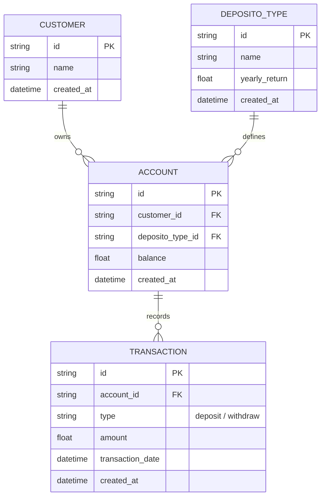
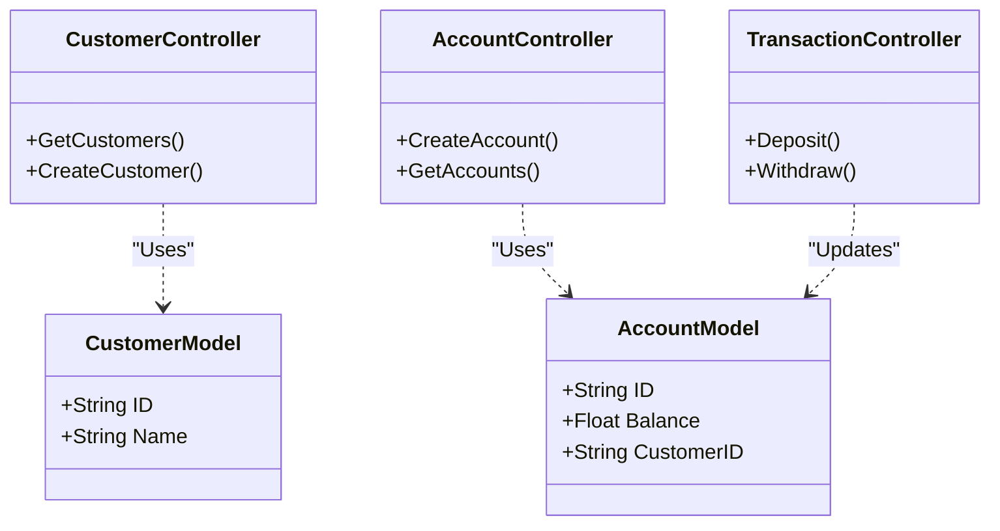

# System Specification - Bank Saving System

## 1. Mockup / User Journey


### User Flow:
1. **Admin/User** logs in to the dashboard.
2. **Customer Management**: Add or edit customer data.
3. **Account Opening**: A customer opens an account and chooses a Deposito Type (Bronze/3%, Silver/5%, Gold/7%).
4. **Transactions**: 
   - User adds balance (Deposit).
   - User withdraws balance. 
5. **Auto Calculation**: System calculates interest earned based on the number of months the money stayed in the account.

## 2. Database Design (ERD)



## 3. UML Diagrams

### Use Case Diagram
```mermaid
usecaseDiagram
    actor "Admin/User" as A
    package "Bank Saving System" {
        usecase "Manage Customers" as UC1
        usecase "Manage Deposito Types" as UC2
        usecase "Open/Close Accounts" as UC3
        usecase "Process Deposit" as UC4
        usecase "Process Withdrawal" as UC5
        usecase "Calculate Interest" as UC6
    }
    A --> UC1
    A --> UC2
    A --> UC3
    A --> UC4
    A --> UC5
    UC5 ..> UC6 : <<include>>
```

### Class Diagram (MVC Pattern)


## 4. API Screen Mapping
| Screen | Action | API Endpoint |
| :--- | :--- | :--- |
| **Dashboard** | Page Load | `GET /api/customers`, `GET /api/accounts` |
| **Customer List** | Add Customer | `POST /api/customers` |
| **Account Management** | Open Account | `POST /api/accounts` |
| **Transaction Modal** | Deposit | `POST /api/transactions/deposit` |
| **Transaction Modal** | Withdraw | `POST /api/transactions/withdraw` |

## 5. API Specifications

| Endpoint | Method | Description |
| :--- | :--- | :--- |
| `/api/customers` | GET | List all customers |
| `/api/customers` | POST | Create new customer |
| `/api/deposito-types` | GET | List deposito types |
| `/api/accounts` | POST | Create new account |
| `/api/transactions/deposit` | POST | Add balance to account |
| `/api/transactions/withdraw` | POST | Withdraw & calc interest |

## 5. Error Handling & Edge Cases

### Edge Cases:
- **Insufficient Balance**: System must reject withdrawal if amount > current balance.
- **Minimum Stay**: What happens if withdrawal occurs in < 1 month? (We should define if it gets 0 interest or pro-rated).
- **Duplicate IDs**: Ensure UUIDs or unique constraints for Customer & Account IDs.
- **Negative Input**: Reject any deposit/withdrawal with negative amount.

### Error Codes:
- `400 Bad Request`: Validation errors (missing fields, negative amount).
- `404 Not Found`: Customer or Account not found.
- `422 Unprocessable Entity`: Business logic errors (e.g., withdrawing more than balance).
- `500 Internal Server Error`: Database connection issues.
